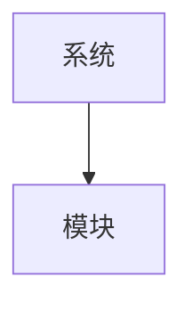

# 专利附图导出为黑白 PNG

将专利交底书中的 Mermaid 附图导出为**符合专利审核要求的黑白 PNG 图片**。

## 功能特点

- ✅ 纯黑白配色（线条黑、文字黑、背景白）
- ✅ 符合专利局审核要求
- ✅ 适合打印和正式提交
- ✅ 高分辨率，保持清晰度
- ✅ 使用技能自带的验证过的脚本
- ✅ 自动检测附图编号并按编号命名

## 执行步骤

当用户调用此斜杠命令时，按以下步骤执行：

### 1. 确定脚本位置

**重要说明**：当使用 `--plugin-dir` 加载技能时，技能目录不在用户的工作目录中。

**智能脚本查找**：使用 Python 递归查找 `export_mermaid.py` 脚本。

```python
# 在命令实现中
def find_export_script():
    """查找 export_mermaid.py 脚本"""
    import subprocess
    import sys

    code = '''
import sys
from pathlib import Path

# 搜索当前目录及子目录
for p in Path(".").rglob("export_mermaid.py"):
    if "scripts" in str(p):
        print(p.resolve())
        sys.exit(0)

# 向上搜索父目录
cwd = Path.cwd()
for parent in [cwd, *cwd.parents]:
    for p in parent.rglob("export_mermaid.py"):
        if "scripts" in str(p):
            print(p.resolve())
            sys.exit(0)

sys.exit(1)
'''

    result = subprocess.run(
        [sys.executable, "-c", code],
        capture_output=True, text=True, timeout=30
    )

    if result.returncode == 0 and result.stdout.strip():
        return result.stdout.strip()
    return None
```

**如果找不到脚本**：

**方法 A**：提示用户直接使用技能中的脚本
```
💡 提示：找不到 export_mermaid.py 脚本

请使用技能中的脚本直接运行：

    python .claude/skills/patent-disclosure-writer/scripts/export_figures.py --dir .
```

**方法 B**：使用内联实现（降级方案）

如果找不到脚本，使用内联的 Python 代码直接实现导出功能（不依赖外部脚本）。

### 2. 验证前置条件

检查 `mmdc` 命令是否可用：
```bash
mmdc --version
```

如果未安装，提示用户运行：
```bash
npm install -g @mermaid-js/mermaid-cli
```

### 3. 构建命令参数

根据用户提供的参数构建 Python 命令：

| 场景 | 命令格式 |
|------|----------|
| 批量导出（默认） | `python "{脚本路径}" --dir . --pattern "0[3-7]_*.md" --output-dir {output_dir}` |
| 单个文件 | `python "{脚本路径}" --markdown "{markdown}" --output-dir {output_dir}` |
| 自定义宽度 | 添加 `--width {width}` 参数 |

**参数默认值**：
- `directory`: 当前目录
- `pattern`: `0[3-7]_*.md`
- `output_dir`: `figures`
- `width`: `2000`

### 4. 执行导出脚本

使用 Bash 工具执行构建的命令，确保：
- 在正确的工作目录中执行
- 传递所有用户指定的参数
- 捕获脚本输出用于结果报告

### 5. 验证输出结果

- 检查 `{output_dir}` 目录是否创建
- 统计生成的 PNG 文件数量
- 验证图片文件是否可读
- 向用户展示导出结果报告

### 6. 处理错误情况

如果脚本执行失败：
- 检查 mmdc 是否安装
- 检查章节文件是否存在
- 检查 Mermaid 语法是否正确
- 提供具体的错误信息和建议

## 快速开始

```bash
# 导出当前目录所有章节的附图（章节 03-07）
/patent-export-figures

# 导出指定目录的附图
/patent-export-figures directory="./patent_chapters"

# 导出单个 Markdown 文件的附图
/patent-export-figures markdown="05_技术方案.md"

# 自定义输出目录
/patent-export-figures output_dir="my_figures"

# 自定义图片宽度（默认 2000px）
/patent-export-figures width=3000
```

## 参数说明

| 参数 | 必需 | 说明 | 默认值 |
|------|------|------|--------|
| `directory` | 否 | 章节文件所在目录 | 当前目录 |
| `pattern` | 否 | 文件匹配模式 | `0[3-7]_*.md` |
| `output_dir` | 否 | 输出目录名称 | `figures` |
| `width` | 否 | 图片宽度像素 | `2000` |
| `markdown` | 否 | 指定单个 Markdown 文件 | 无 |

**注意**：`directory` 和 `markdown` 参数互斥，只能使用其中一个。

## 使用场景

### 场景 1：导出所有章节的附图

当你生成了完整的专利交底书章节后，一次性导出所有附图：

```bash
/patent-export-figures
```

输出：
```
figures/
├── fig01_现有技术架构示意图.png
├── fig02_问题场景示意图.png
├── fig03_系统整体架构图.png
└── ...
```

### 场景 2：导出单个章节的附图

当你只想导出某个特定章节的附图：

```bash
/patent-export-figures markdown="05_技术方案.md"
```

### 场景 3：自定义输出目录

当你想将附图导出到特定目录：

```bash
/patent-export-figures output_dir="patent_figures"
```

### 场景 4：调整图片分辨率

当你需要更高或更低的分辨率：

```bash
# 高分辨率（适合打印）
/patent-export-figures width=3000

# 标准分辨率（默认）
/patent-export-figures width=2000

# 低分辨率（快速预览）
/patent-export-figures width=1000
```

## 前置要求

使用本命令需要先安装 `mermaid-cli`：

```bash
npm install -g @mermaid-js/mermaid-cli
```

验证安装：

```bash
mmdc --version
```

## 导出效果

导出的 PNG 图片具有以下特性：

| 特性 | 说明 |
|------|------|
| 背景色 | 纯白色（#FFFFFF） |
| 线条颜色 | 纯黑色（#000000） |
| 文字颜色 | 纯黑色（#000000） |
| 分辨率 | 宽度可配置（默认 2000px），高度自动按比例 |
| 格式 | PNG（无损压缩） |
| 命名 | 按附图编号自动命名（fig01.png, fig02.png, ...） |

## 输出示例

```
附图导出完成

输出目录: figures
处理章节: 5 个
导出附图: 8 幅

---
导出详情

| 章节文件 | 附图数量 | 状态 |
|---------|---------|------|
| 03_背景技术.md | 1 | ✅ |
| 04_技术问题.md | 1 | ✅ |
| 05_技术方案.md | 2 | ✅ |
| 06_有益效果.md | 1 | ✅ |
| 07_具体实施方式.md | 3 | ✅ |

---
生成的图片文件

- figures/fig01_现有技术架构示意图.png
- figures/fig02_问题场景示意图.png
- figures/fig03_系统整体架构图.png
- figures/fig04_IP地址分配协议格式图.png
- figures/fig05_效果对比示意图.png
- figures/fig06_设备启动初始化流程图.png
- figures/fig07_IP地址分配流程图.png
- figures/fig08_设备选举时序图.png

---
图片特性

✅ 纯黑白配色（线条黑、文字黑、背景白）
✅ 符合专利局审核要求
✅ 适合打印和正式提交
✅ 高分辨率（2000px 宽度）

---
后续操作

您现在可以：
1. 查看 figures 文件夹中的图片
2. 手动将这些黑白 PNG 图片插入到 DOCX 文件中
3. 或重新运行本命令以更新图片
```

## 错误处理

### mermaid-cli 未安装

```
❌ 错误：mermaid-cli 未安装

💡 解决方法：

1. 安装 Node.js（如果未安装）
   访问: https://nodejs.org/

2. 安装 mermaid-cli
   npm install -g @mermaid-js/mermaid-cli

3. 验证安装
   mmdc --version
```

### 未找到 Mermaid 图表

```
⚠️ 警告：未找到任何 Mermaid 图表
📂 目录: /path/to/directory
🔍 模式: 0[3-7]_*.md

💡 可能的原因：
1. 章节文件中不包含 Mermaid 代码块
2. 文件模式不匹配
3. 目录路径错误

💡 解决方法：
1. 检查章节文件内容
2. 调整文件模式参数
3. 确认目录路径正确
```

### 导出脚本不存在

```
❌ 错误：导出脚本不存在
📄 期望路径: .claude/skills/patent-disclosure-writer/scripts/export_mermaid.py

💡 解决方法：
1. 确认 patent-disclosure-writer 技能已正确安装
2. 检查技能目录结构是否完整
3. 重新安装技能
```

## 实现原理

本命令使用技能自带的 `export_mermaid.py` 脚本，通过以下方式确保黑白输出：

1. **黑白主题配置**：使用 `mermaid-bw-theme.json` 强制所有元素为黑白
2. **CSS 样式覆盖**：使用 `mermaid-bw-style.css` 强制覆盖所有颜色
3. **白色背景**：设置 `-b white` 参数确保背景为白色
4. **高分辨率**：设置 `-w` 参数控制图片宽度

## 手动使用脚本

如果你想直接使用脚本而不通过斜杠命令：

```bash
# 使用包装脚本（推荐，会自动查找模板）
python .claude/skills/patent-disclosure-writer/scripts/export_figures.py \
  --dir . \
  --pattern "0[3-7]_*.md" \
  --output-dir figures

# 或直接使用 export_mermaid.py
python .claude/skills/patent-disclosure-writer/scripts/export_mermaid.py \
  --dir . \
  --pattern "0[3-7]_*.md" \
  --output-dir figures
```

## 相关命令

- `/patent` - 生成完整的专利交底书
- `/patent-update-diagrams` - 智能补充缺失的附图
- `/patent-md-2-docx` - 将 Markdown 转换为 DOCX

## 工作流程建议

推荐的专利交底书制作流程：

```bash
# 1. 生成专利交底书章节
/patent

# 2. 查看生成的附图（Mermaid 格式）
cat 0[3-7]_*.md

# 3. 导出附图为黑白 PNG
/patent-export-figures

# 4. 将 PNG 图片手动插入到 DOCX 模板中
# 或使用转换命令（如果支持）
/patent-md-2-docx
```

## 技术细节

### 附图编号检测

脚本自动识别 Markdown 文件中的附图编号：

```markdown
#### 附图1：系统架构图


```

将被导出为 `fig01_系统架构图.png`。

### 文件命名规则

- 如果检测到附图编号：`fig{编号}_{附图名称}.png`
- 如果未检测到附图编号：`fig{序号}.png`

### 支持的附图类型

- 流程图（flowchart）
- 时序图（sequence diagram）
- 架构图（architecture diagram）
- 协议格式图（protocol format diagram）
- 状态图（state diagram）
- 类图（class diagram）
- 所有其他 Mermaid 支持的图表类型
