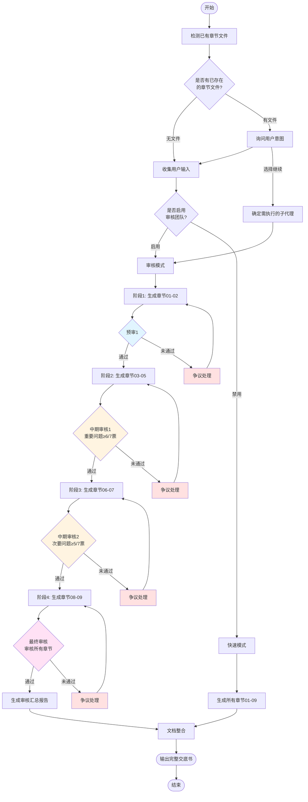
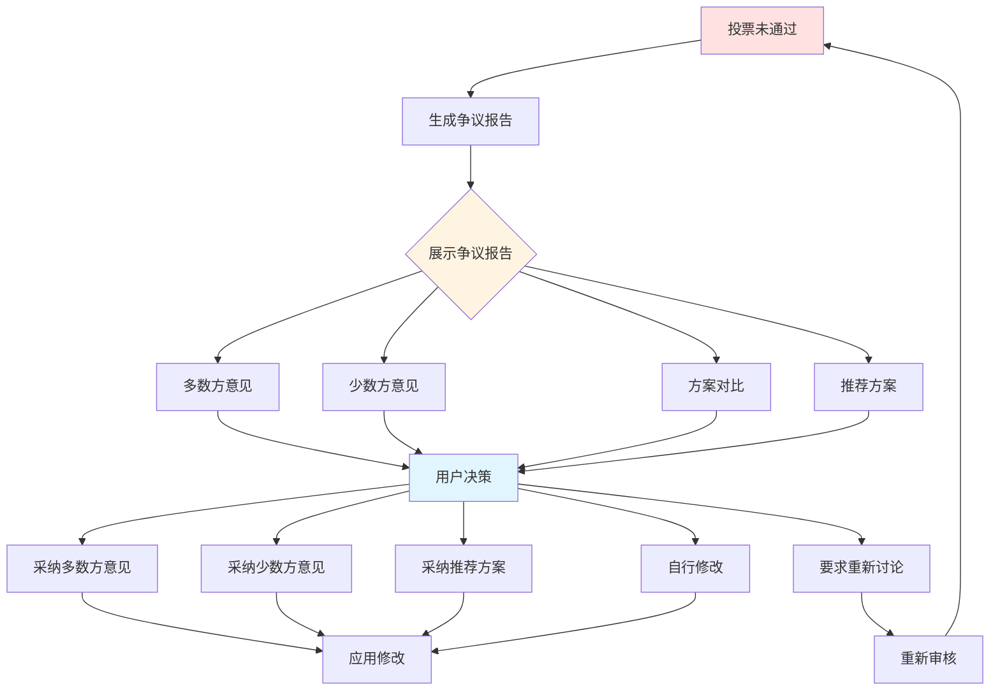

# Patent Disclosure Writer

> 自动化生成专利交底书的 Claude Code 技能
>
> **版本**: 2.0.0 | **Timelessness Score**: 8/10 | **基于**: skillforge v4.0 标准

## 项目简介

本技能提供了一套完整的专利交底书自动化生成解决方案，包括专利检索、技术分析、文档生成、格式转换和质量验证等功能。

## 功能特性

### 核心功能

- **智能专利检索**：基于发明的技术领域和关键词进行精准检索
- **结构化内容生成**：自动生成符合 IP-JL-027 标准的专利交底书各部分内容
- **图表自动生成**：使用 Mermaid 生成流程图、序列图等专利附图
- **多格式导出**：支持 Markdown 和 Word (.docx) 格式导出
- **断点续传**：支持中断后继续生成，可选择性重新生成特定章节

### 新增功能 (v2.0.0)

- **👥 5人专家团队审核系统**
  - 资深技术专家、技术专家、法律专家、资深专利代理人、专利代理人
  - 4阶段审核流程（预审、中期审核×2、最终审核）
  - 加权投票机制（7票制）
  - 争议解决和用户决策
- **📊 智能修改建议**
  - 自动应用明显错误
  - 用户确认重大改动
  - 版本控制和修改日志
- **📝 专业审核报告**
  - 阶段审核报告
  - 审核汇总报告
  - 争议报告

### 新增功能 (v1.1.0)

- **📋 文档验证**：验证交底书完整性和规范性
- **🔍 附图检查**：检查附图编号连续性
- **📊 Mermaid 验证**：验证 Mermaid 图表语法
- **💾 状态管理**：专用状态文件管理生成进度
- **🛡️ Windows 兼容**：全平台 UTF-8 编码支持

## 安装使用

### 方式一：作为项目级技能

1. 将本仓库复制到你的项目中
2. 确保 `.claude/skills/` 目录存在
3. 在 Claude Code 中使用时，技能会自动加载

### 方式二：作为个人技能

1. 复制 `patent-disclosure-writer` 目录到 `~/.claude/skills/`
2. 重启 Claude Code

## 使用方法

### 使用技能

在 Claude Code 中直接描述需求，技能会自动触发：

```
写专利交底书
生成专利文档
专利申请
技术交底书
申请发明专利
```

### 使用斜杠命令

本技能包含以下斜杠命令：

| 命令 | 功能 |
|------|------|
| `/patent` | 启动专利交底书生成流程（支持断点续传） |
| `/patent-md-2-docx` | 将 Markdown 格式转换为 Word 文档 |
| `/patent-update-diagrams` | 更新专利文档中的图表 |

### 使用验证脚本

```bash
# 验证交底书完整性
python .claude/skills/patent-disclosure-writer/scripts/validate_disclosure.py

# 验证 Mermaid 图表语法
python .claude/skills/patent-disclosure-writer/scripts/validate_mermaid.py

# 检查附图编号连续性
python .claude/skills/patent-disclosure-writer/scripts/check_figures.py

# 管理生成状态
python .claude/skills/patent-disclosure-writer/scripts/state_manager.py --status

# 管理审核状态
python .claude/skills/patent-disclosure-writer/scripts/review_state_manager.py --status pre1
```

## 执行流程

### 完整流程（启用审核模式）



### 快速模式流程（无审核）


### 审核流程详情

| 阶段 | 审核章节 | 投票阈值 | 专家团队 |
|------|---------|---------|----------|
| **预审1** | 01-02 | 简单多数 | 全部5位专家 |
| **中期审核1** | 03-05 | ≥6/7票 | 资深专家权重更高 |
| **中期审核2** | 06-07 | ≥5/7票 | 重点关注技术细节 |
| **最终审核** | 01-09 | ≥6/7票 | 整体质量严格把关 |

### 争议处理流程



## 技能结构

```
patent-disclosure-writer-skill/
├── .claude/
│   ├── skills/
│   │   └── patent-disclosure-writer/
│   │       ├── SKILL.md              # 技能定义
│   │       ├── scripts/              # 验证脚本 (v1.1.0 新增)
│   │       │   ├── validate_disclosure.py
│   │       │   ├── validate_mermaid.py
│   │       │   ├── check_figures.py
│   │       │   └── state_manager.py
│   │       ├── references/           # 参考文档
│   │       │   ├── configuration.md
│   │       │   ├── agents.md
│   │       │   └── troubleshooting.md
│   │       ├── templates/            # 专利模板
│   │       │   └── IP-JL-027(A／0)专利申请技术交底书模板.md
│   │       └── example_things/       # 示例文件
│   └── agents/
│       └── patent/                   # 专利相关子代理（10个）
├── commands/                         # 斜杠命令
│   ├── patent.md
│   └── patent-md-2-docx.md
└── plans/                            # 改进计划
    └── skillforge-improvement-plan.md
```

## 子代理架构

本技能使用 10 个专业子代理，每个子代理负责专利交底书生成的特定环节：

| 序号 | 子代理 | 功能 | 输出 |
|------|--------|------|------|
| 1 | title-generator | 发明名称生成 | 01_发明名称.md |
| 2 | field-analyzer | 技术领域分析 | 02_技术领域.md |
| 3 | background-researcher | 背景技术调研 | 03_背景技术.md |
| 4 | problem-analyzer | 技术问题分析 | 04_技术问题.md |
| 5 | solution-designer | 技术方案设计 | 05_技术方案.md |
| 6 | benefit-analyzer | 有益效果分析 | 06_有益效果.md |
| 7 | implementation-writer | 具体实施方式编写 | 07_具体实施方式.md |
| 8 | protection-extractor | 保护点提炼 | 08_专利保护点.md |
| 9 | reference-collector | 参考资料收集 | 09_参考资料.md |
| 10 | document-integrator | 文档整合 | 专利申请技术交底书_[发明名称].md |

### 审核代理架构（v2.0.0 新增）

| 序号 | 审核代理 | 角色 | 权重 |
|------|---------|------|------|
| 22 | review-coordinator | 审核协调器 | - |
| 23 | expert-sr-tech | 资深技术专家 | 2票 |
| 24 | expert-tech | 技术专家 | 1票 |
| 25 | expert-legal | 法律专家 | 1票 |
| 26 | expert-sr-agent | 资深专利代理人 | 2票 |
| 27 | expert-agent | 专利代理人 | 1票 |
| 28 | review-synthesizer | 审核意见汇总器 | - |
| 29 | dispute-resolver | 争议解决器 | - |
| 30 | modification-applier | 修改应用器 | - |
| 31 | report-generator | 报告生成器 | - |

## MCP 工具依赖

本技能依赖以下 MCP 服务：

| MCP 服务 | 用途 | 获取地址 |
|---------|------|----------|
| web-search-prime | 网络搜索 | https://open.bigmodel.cn/ |
| web-reader | 网页内容提取 | https://open.bigmodel.cn/ |
| google-patents-mcp | 专利检索 | https://serpapi.com/ |
| exa | 技术文档搜索 | https://exa.ai/api-key |

### MCP 配置示例

在 `~/.claude/settings.json` 中配置 MCP 服务：

```json
{
  "mcpServers": {
    "web-search-prime": {
      "type": "http",
      "url": "https://open.bigmodel.cn/api/mcp/web_search_prime/mcp",
      "headers": {
        "Authorization": "Bearer YOUR_ZHIPU_API_KEY"
      }
    },
    "web-reader": {
      "type": "http",
      "url": "https://open.bigmodel.cn/api/mcp/web_reader/mcp",
      "headers": {
        "Authorization": "Bearer YOUR_ZHIPU_API_KEY"
      }
    },
    "google-patents-mcp": {
      "command": "npx",
      "args": ["-y", "@kunihiros/google-patents-mcp"],
      "env": {
        "SERPAPI_API_KEY": "YOUR_SERPAPI_KEY"
      }
    },
    "exa": {
      "command": "npx",
      "args": ["-y", "exa-mcp-server"],
      "env": {
        "EXA_API_KEY": "YOUR_EXA_API_KEY"
      }
    }
  }
}
```

详细配置说明见：[references/configuration.md](.claude/skills/patent-disclosure-writer/references/configuration.md)

## 版本历史

| 版本 | 日期 | 变更说明 |
|------|------|----------|
| 2.0.0 | 2025-01-15 | 添加5人专家团队审核系统，支持分阶段审核、投票机制、争议解决 |
| 1.1.0 | 2025-01-14 | 添加验证脚本、状态管理、演进性分析，Timelessness 评分 8/10 |
| 1.0.0 | 2025-01-14 | 初始版本 |

## 技能质量指标

| 指标 | 评分 |
|------|------|
| Timelessness Score | 8/10 ✅ |
| skillforge 标准验证 | 通过 ✅ |
| Windows 兼容性 | 完全支持 ✅ |
| 审核系统 | 5人专家团队 ✅ |

## 许可证

MIT License

## 作者

allanpk716 <allanpk716@gmail.com>

## 相关链接

- [EasyJob Skills Marketplace](https://github.com/allanpk716/EasyJobSkills)
- [Claude Code 官方文档](https://code.claude.com/docs/en/skills)
- [改进计划](plans/skillforge-improvement-plan.md)
