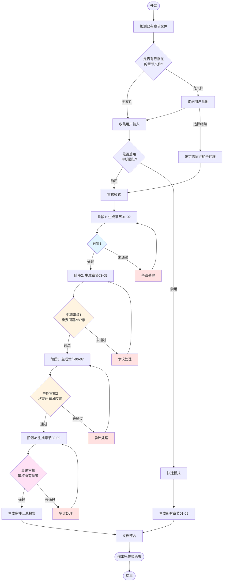
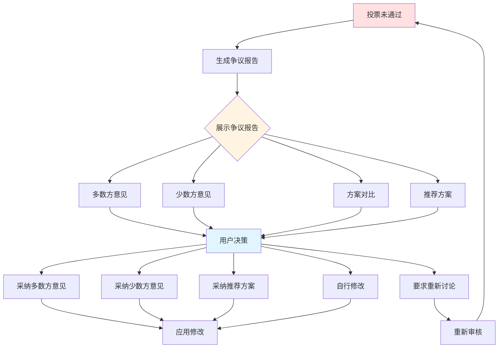
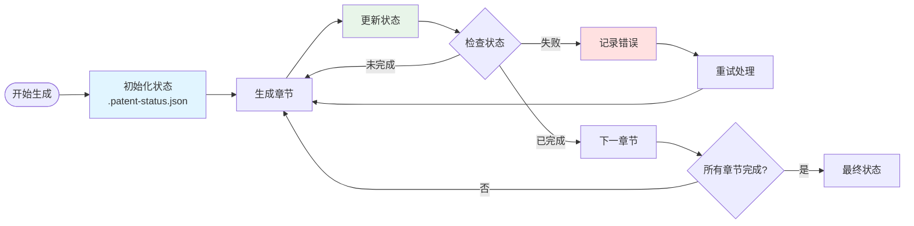

# 专利申请技术交底书生成

你正在调用专利申请技术交底书自动化生成技能。本技能将帮助你完成从创新想法到完整交底书的整个过程。

## 审核团队配置

本技能支持5人专家团队审核，可配置是否启用：

### 启用审核（默认）

```
# 使用完整审核流程
/patent
# 按提示选择：启用审核团队
```

### 禁用审核

```
# 快速模式，跳过审核
/patent
# 按提示选择：快速模式（无审核）
```

### 审核团队配置

| 角色 | 数量 | 权重 | 职责 |
|------|------|------|------|
| 资深技术专家 | 1 | 2票 | 技术可行性、创新性 |
| 技术专家 | 1 | 1票 | 技术细节、实施可行性 |
| 法律专家 | 1 | 1票 | 法律合规性 |
| 资深专利代理人 | 1 | 2票 | 保护范围、专利策略 |
| 专利代理人 | 1 | 1票 | 文档规范性、格式 |

**总票数**: 7票（加权）

### 投票阈值

| 问题类型 | 通过阈值 | 说明 |
|---------|---------|------|
| 重要问题 | ≥6/7票 | 技术方案错误、法律违规、保护范围问题 |
| 次要问题 | ≥5/7票 | 格式规范、措辞优化、附图改进 |

## 状态管理（可选）

本技能支持使用专用状态文件来跟踪生成进度，提供更可靠的状态管理。

### 使用 state_manager.py

**初始化状态**（在开始生成前可选）：
```bash
python .claude/skills/patent-disclosure-writer/scripts/state_manager.py \
  --init \
  --idea "创新想法" \
  --patent-type "发明专利" \
  --technical-field "所属技术领域" \
  --keywords "关键词1,关键词2"
```

**查看当前状态**：
```bash
python .claude/skills/patent-disclosure-writer/scripts/state_manager.py --status
```

**标记章节完成**（每个子代理完成后可选）：
```bash
python .claude/skills/patent-disclosure-writer/scripts/state_manager.py \
  --mark-completed "03"
```

**获取附图编号**（用于连续编号）：
```bash
python .claude/skills/patent-disclosure-writer/scripts/state_manager.py --get figure_number
```

**重置状态**（开始新任务前）：
```bash
python .claude/skills/patent-disclosure-writer/scripts/state_manager.py --reset
```

### 状态文件格式

状态保存在 `.patent-status.json`：
```json
{
  "version": "1.1.0",
  "idea": "创新想法内容",
  "patent_type": "发明专利",
  "technical_field": "所属技术领域",
  "keywords": ["关键词1", "关键词2"],
  "completed_chapters": ["01", "02", "03"],
  "current_chapter": "04",
  "failed_chapters": [],
  "figure_number": 3,
  "timestamp": "2025-01-14T10:30:00Z",
  "errors": []
}
```

### 与文件扫描模式的关系

- **状态文件模式**（推荐）：使用 `.patent-status.json` 管理状态，更可靠
- **文件扫描模式**（备用）：扫描章节文件判断进度，向后兼容

两种模式可以同时使用，状态文件优先。

## 智能继续模式

本命令支持智能检测已完成的章节及附图状态，只执行剩余步骤。

### 工作流程

**0. 工作目录确认**
- 默认使用当前目录
- 如果当前目录无章节文件，询问是否使用其他目录（如 `C:\WorkSpace\专利`）

**1. 检测已完成章节**
- 扫描工作目录中的 `01-09_*.md` 文件
- 记录已存在的章节文件
- 检测章节文件中是否包含附图（使用正则 `/#### 附图\d+：/` 检测）
- 统计附图编号和数量

**2. 分析完成进度**
- 根据已存在的文件判断哪些子代理已完成
- 检查附图编号连续性
- 判断是否需要跳过某些步骤

**3. 智能对话确认**
- 如果发现已有章节文件，询问用户意图：
  - "检测到已有X个章节文件，其中Y个包含附图。是否从已有章节继续？"
  - 选项：[继续执行] [重新生成] [选择特定章节重新生成]

**4. 选择性执行**
- 如果选择"继续执行"：只调用缺失步骤对应的子代理
- 如果所有9个章节都存在：直接调用 document-integrator
- 如果选择"重新生成"：执行所有子代理
- 如果选择"选择特定章节"：让用户选择要重新生成的章节

### 附图状态检测

**需要检测附图的章节**：03, 04, 05, 06, 07

**不需要检测附图的章节**：01, 02, 08, 09

**检测方法**：

对每个章节文件（03-07），检查是否包含附图：

```
检测附图标记：/#### 附图\d+：/
检测 Mermaid 代码：/```mermaid/
```

**状态报告格式**：

```
=== 章节状态检测报告 ===

已完成的章节：
✓ 01_发明名称.md - 完成
✓ 02_技术领域.md - 完成
✓ 05_技术方案.md - 包含 3 幅附图（图1, 图2, 图3）

缺少或需要更新的章节：
✗ 03_背景技术.md - 不存在
✗ 07_具体实施方式.md - 已存在但无附图（可能是旧版本）

附图统计：共 3 幅（图1-图3）

选择操作：
[1] 继续执行（跳过已完成章节）
[2] 重新生成特定章节
[3] 全部重新生成
```

### 附图编号连续性验证

扫描所有章节文件提取附图编号，验证编号是否连续：

```
验证附图编号连续性：
- 扫描所有章节文件提取附图编号
- 检查编号是否连续（1,2,3,4,5...）
- 如果发现跳号，提示用户

示例：
⚠ 警告：附图编号不连续
  - 05_技术方案.md: 图1, 图2, 图3
  - 07_具体实施方式.md: 图5, 图6

  缺少图4，可能需要重新生成 07_具体实施方式.md
```

### 章节文件映射

| 文件名 | 对应子代理 | 附图职责 | 变更说明 |
|--------|-----------|---------|---------|
| 01_发明名称.md | title-generator | 无附图 | 不变 |
| 02_技术领域.md | field-analyzer | 无附图 | 不变 |
| 03_背景技术.md | background-researcher | **可选：现有技术架构图** | 根据内容动态生成并嵌入附图 |
| 04_技术问题.md | problem-analyzer | **可选：问题场景图** | 根据内容动态生成并嵌入附图 |
| 05_技术方案.md | solution-designer | **核心：架构图、协议图** | 根据内容动态生成并嵌入附图 |
| 06_有益效果.md | benefit-analyzer | **可选：效果对比图** | 根据内容动态生成并嵌入附图 |
| 07_具体实施方式.md | implementation-writer | **核心：流程图、时序图** | 根据内容动态生成并嵌入附图 |
| 08_专利保护点.md | protection-extractor | 无附图 | 不变 |
| 09_参考资料.md | reference-collector | 无附图 | 不变 |

**附图生成方式**：附图已由各章节生成器在生成章节内容时根据需要动态生成并嵌入到章节文件中（以 Mermaid 代码块形式），无需单独的附图生成步骤。

## 执行流程图

### 完整流程（启用审核模式）



### 快速模式流程（无审核）


### 审核流程详情

| 阶段 | 审核章节 | 投票阈值 | 说明 |
|------|---------|---------|------|
| **预审1** | 01-02 | 简单多数 | 初始质量检查 |
| **中期审核1** | 03-05 | ≥6/7票 | 重要问题严格审查 |
| **中期审核2** | 06-07 | ≥5/7票 | 次要问题适度审查 |
| **最终审核** | 01-09 | ≥6/7票 | 整体质量严格把关 |

### 争议处理流程



### 状态管理流程



## 执行步骤

请按以下步骤执行：

### 1. 收集用户输入并检测已有章节

**步骤 1.1：检测工作目录中的章节文件**

使用 Glob 工具扫描当前目录中的章节文件：

```
Glob: [0-9][0-9]_*.md
```

记录已存在的章节文件，例如：
- `01_发明名称.md` ✓
- `02_技术领域.md` ✓
- ...
- `10_附图说明.md` ✓

**验证筛选**：

从 Glob 返回的结果中筛选有效的章节文件：

验证标准：
- 文件名格式：`[数字][数字]_[标题].md`
- 章节编号范围：01-10
- 排除无效编号（如 00、11+）

**步骤 1.2：根据检测结果确定工作流程**

**场景 A：未检测到任何章节文件**
- 执行完整的专利交底书生成流程
- 进入步骤 1.3 收集用户输入

**场景 B：检测到部分章节文件（1-9个）**
- 向用户展示已存在的章节文件列表
- 询问用户意图：
  ```
  检测到已有 X 个章节文件：
  ✓ 01_发明名称.md
  ✓ 02_技术领域.md
  ...

  是否从已有章节继续生成交底书？
  [继续执行] [重新生成] [选择特定章节重新生成]
  ```
- 根据用户选择执行相应操作

**场景 C：检测到全部9个章节文件**
- 询问用户是否直接生成交底书：
  ```
  检测到已有完整的9个章节文件（01-09）。

  是否直接生成交底书文档？
  [直接生成交底书] [重新生成所有章节] [选择特定章节重新生成]
  ```
- 如果选择"直接生成交底书"，跳到步骤 2.10 调用 document-integrator

**步骤 1.3：目录确认（可选）**

如果当前目录未检测到章节文件，询问用户：
```
当前目录未检测到章节文件。
是否使用其他目录？（如 C:\WorkSpace\专利）
```

**步骤 1.4：收集用户输入（如果需要从头开始）**

如果用户选择重新生成或未检测到章节文件，请询问：

- **创新想法 (idea)**: 请描述你的创新内容或技术改进思路
- **所属技术领域 (technical_field)**: 这项技术属于哪个领域？
- **关键词 (keywords)**: 可选，用于搜索相关技术的关键词
- **是否启用审核团队 (enable_review)**: 是否启用5人专家团队审核？
  - 选项：[启用审核（推荐）] [快速模式（无审核）]
  - 默认：启用审核

### 2. 按顺序调用子代理

**步骤 2.0：确定需要执行的子代理**

根据步骤 1 的检测结果和用户选择，确定需要执行的子代理列表：

- **重新生成模式**：执行所有9个子代理（步骤 2.1 - 2.9）+ document-integrator
- **继续执行模式**：跳过已存在文件的子代理，只执行缺失的子代理
- **选择特定章节模式**：只执行用户选择的子代理

**附图编号管理**：

使用全局附图编号计数器，确保附图编号连续：

```
初始化：current_figure_number = 1

对每个章节生成器（03-07）：
1. 调用时传入 current_figure_number 作为起始附图编号
2. 章节生成器返回实际生成的附图数量
3. 更新：current_figure_number += diagrams_generated

示例：
- solution-designer(起始编号=1) → 返回生成3幅图 → current_figure_number = 4
- implementation-writer(起始编号=4) → 返回生成2幅图 → current_figure_number = 6
```

**步骤 2.1 - 2.9：调用各章节生成子代理 + 审核流程**

本步骤将章节生成与审核流程整合，分为5个阶段：

**步骤 2.1：生成章节01-02 + 预审**

```
# 生成章节 01-02
使用 Task 工具调用：
1. title-generator        - 生成发明名称（如果 01_发明名称.md 不存在）
   参数：idea（创新想法）

2. field-analyzer         - 分析所属技术领域（如果 02_技术领域.md 不存在）
   参数：idea, technical_field

# 预审1（审核章节01-02）
如果启用审核，使用 Task 工具调用 review-coordinator：
- review_stage: "pre1"
- chapters: ["01", "02"]
- patent_type: {patent_type}

如果审核未通过：
- 调用 dispute-resolver 处理争议
- 等待用户决策
- 根据决策继续或重新生成
```

**步骤 2.2：生成章节03-05 + 中期审核1**

```
# 生成章节 03-05
使用 Task 工具调用：
3. background-researcher  - 调研背景技术（如果 03_背景技术.md 不存在）
   参数：patent_type, idea, keywords, starting_figure_number={current_figure_number}
   使用：web-search-prime, google-patents-mcp, exa, web-reader
   返回：实际生成的附图数量（可能为0）
   更新：current_figure_number += diagrams_generated

4. problem-analyzer       - 分析解决的技术问题（如果 04_技术问题.md 不存在）
   参数：patent_type, idea, background_content, starting_figure_number={current_figure_number}
   返回：实际生成的附图数量（可能为0）
   更新：current_figure_number += diagrams_generated

5. solution-designer      - 设计技术方案（如果 05_技术方案.md 不存在）
   参数：patent_type, idea, starting_figure_number={current_figure_number}
   使用：exa, web-search-prime
   返回：实际生成的附图数量（可能为0）
   更新：current_figure_number += diagrams_generated

# 中期审核1（审核章节03-05，重要问题）
如果启用审核，使用 Task 工具调用 review-coordinator：
- review_stage: "mid1"
- chapters: ["03", "04", "05"]
- patent_type: {patent_type}

重要问题阈值：需 6/7 票通过

如果审核未通过：
- 调用 dispute-resolver 处理争议
- 等待用户决策
- 根据决策继续或重新生成
```

**步骤 2.3：生成章节06-07 + 中期审核2**

```
# 生成章节 06-07
使用 Task 工具调用：
6. benefit-analyzer       - 分析有益效果（如果 06_有益效果.md 不存在）
   参数：patent_type, solution_content, starting_figure_number={current_figure_number}
   返回：实际生成的附图数量（可能为0）
   更新：current_figure_number += diagrams_generated

7. implementation-writer  - 编写具体实施方式（如果 07_具体实施方式.md 不存在）
   参数：patent_type, solution_content, starting_figure_number={current_figure_number}
   使用：exa, web-search-prime
   返回：实际生成的附图数量（可能为0）
   更新：current_figure_number += diagrams_generated

# 中期审核2（审核章节06-07）
如果启用审核，使用 Task 工具调用 review-coordinator：
- review_stage: "mid2"
- chapters: ["06", "07"]
- patent_type: {patent_type}

如果审核未通过：
- 调用 dispute-resolver 处理争议
- 等待用户决策
- 根据决策继续或重新生成
```

**步骤 2.4：生成章节08-09 + 最终审核**

```
# 生成章节 08-09
使用 Task 工具调用：
8. protection-extractor   - 提炼保护点（如果 08_专利保护点.md 不存在）
   参数：idea, solution_content

9. reference-collector    - 收集参考资料（如果 09_参考资料.md 不存在）
   使用：google-patents-mcp, web-search-prime, web-reader

# 最终审核（审核所有章节 + 整体质量）
如果启用审核，使用 Task 工具调用 review-coordinator：
- review_stage: "final"
- chapters: ["01", "02", "03", "04", "05", "06", "07", "08", "09"]
- patent_type: {patent_type}

生成审核汇总报告

如果审核未通过：
- 调用 dispute-resolver 处理争议
- 等待用户决策
- 根据决策继续或重新生成
```

**跳过逻辑示例**：

如果检测到某些章节文件已存在，则跳过对应的生成器和审核：
```
✓ 01_发明名称.md 已存在，跳过 title-generator
✓ 02_技术领域.md 已存在，跳过 field-analyzer
→ 如果章节01-02都存在，直接进入预审或跳过预审
→ 执行 background-researcher...
```

**步骤 2.5：调用文档整合子代理**

所有必需章节生成且审核通过后，调用 document-integrator：

```
10. document-integrator   - 整合所有章节生成完整交底书
    输入：patent_type（专利类型）
    输出：Markdown 格式的完整交底书（附图已嵌入在各章节中）
```

**注意**：
- 如果禁用审核，则跳过所有审核步骤，直接执行文档整合
- 如果某个阶段的审核未通过，需要修复问题后才能进入下一阶段
- 审核状态会保存在状态文件中，支持断点续传
```

### 3. 输出结果

- 每个子代理生成一个独立的 Markdown 文件
- 附图以 Mermaid 代码块形式嵌入在对应章节文件中（03-07章节）
- 最终生成完整的交底书文档：`专利申请技术交底书_[发明名称].md`

**附图说明**：
- 附图已由各章节生成器根据内容需要动态生成并嵌入到章节中
- 附图编号从1开始连续编号（图1、图2、图3...）
- 每幅附图包含：附图标题、Mermaid 代码块、附图说明文字

## MCP 工具说明

本技能依赖以下 MCP 服务：

| MCP 服务 | 用途 |
|---------|------|
| google-patents-mcp | 专利检索 |
| exa | 技术文档和代码搜索 |
| web-reader | 网页内容提取 |
| web-search-prime | 网络搜索 |

## 错误处理和重试机制

### 子代理执行失败处理

当子代理执行失败时，按照以下策略处理：

**重试策略**：
```
第一次失败：等待 5 秒后自动重试
第二次失败：等待 10 秒后自动重试
第三次失败：询问用户操作选择
```

**用户选项**：
```
❌ [子代理名称] 执行失败（第 3 次）

**失败原因**: [具体错误信息]

**影响范围**: [哪些内容无法生成]

**建议操作**：
[1] 继续执行（跳过此步骤，后续可手动补充）
[2] 重试此步骤
[3] 终止流程

请选择操作 (1-3):
```

### MCP 服务不可用降级策略

当 MCP 服务不可用时，使用降级模式：

**完整模式（默认）**：
- 使用所有 MCP 服务
- 进行深度专利检索
- 生成完整的附图

**降级模式**：
- 仅使用基础搜索
- 跳过详细的专利检索
- 生成关键附图
- 标注内容可能需要补充

```
⚠️ 部分 MCP 服务不可用

**不可用的服务**: [服务列表]

**降级模式已启用**：
- 跳过深度专利检索
- 使用基础网络搜索
- 附图可能不完整

是否继续？[继续] [取消]
```

**离线模式提示**：
```
⚠️ 所有 MCP 服务不可用

**离线模式**：仅基于用户提供的信息生成

**注意**：
- 无专利检索
- 无技术资料搜索
- 质量可能较低

建议先配置 MCP 服务后使用。
是否继续？[继续] [配置指南] [取消]
```

### 网络超时处理

**超时设置**：
- 搜索操作：30 秒超时
- 网页抓取：60 秒超时
- 子代理执行：5 分钟超时

**超时后处理**：
```
⚠️ 操作超时

**操作**: [操作名称]
**超时时间**: [时间]

**建议操作**：
[1] 重试（增加超时时间）
[2] 跳过此步骤
[3] 终止流程

请选择操作 (1-3):
```

### 文件写入失败处理

```
❌ 文件写入失败

**文件路径**: [文件路径]
**失败原因**: [磁盘空间不足/权限不足/目录不存在]

**解决方法**：
1. 检查磁盘空间
2. 检查目录权限
3. 创建必要的目录

是否重试？[重试] [更改输出目录] [跳过]
```

### 状态保存和恢复

**断点续传状态文件**：
```
.patent-status.json
```

**状态文件内容**：
```json
{
  "idea": "创新想法内容",
  "patent_type": "发明专利",
  "completed_chapters": ["01", "02", "05"],
  "current_chapter": "03",
  "failed_chapters": [],
  "figure_number": 4,
  "timestamp": "2024-01-15T10:30:00Z",
  "errors": []
}
```

**恢复提示**：
```
检测到未完成的生成任务

**上次执行时间**: [时间戳]
**已完成章节**: [章节列表]
**当前章节**: [章节名称]

是否继续？[继续] [重新开始] [查看详情]
```

## 注意事项

- 必须使用 Task 工具调用子代理，不要自行完成子代理的工作
- 每个子代理完成后确认输出文件已生成
- 确保用户安装了所需的 MCP 服务
- 执行过程中会自动保存进度，支持断点续传
- 遇到错误时会提供明确的解决建议
